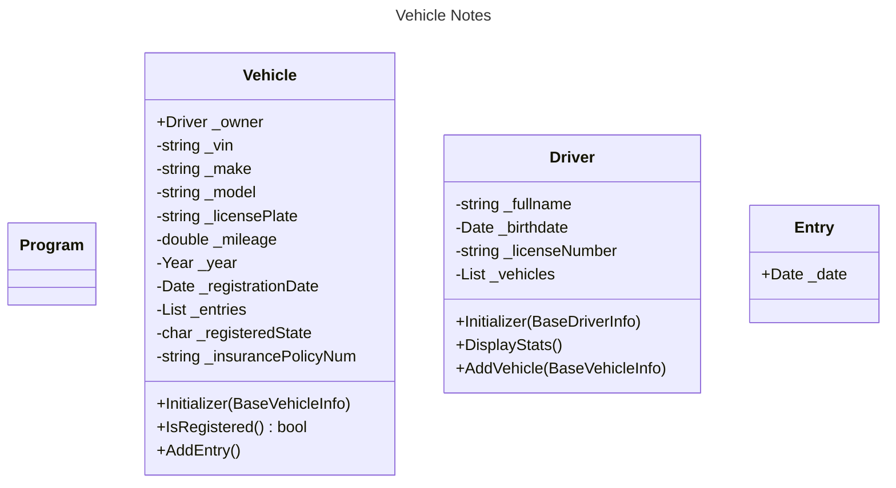

## UML class diagram for Prototypes

```mermaid
---
title: Vehicle Notes
---
classDiagram
    class Program {
        
    }
    class Vehicle {
        +Driver _owner
        -string _vin
        -string _make
        -string _model
        -string _licensePlate
        -double _mileage
        -Year _year
        -Date _registrationDate
        -List<Entry> _entries
        -char _registeredState
        -string _insurancePolicyNum
        
        +Initializer(BaseVehicleInfo)
        +IsRegistered() bool
        +AddEntry()
    }
    class Driver {
        -string _fullname
        -Date _birthdate
        -string _licenseNumber
        -List<Vehicle> _vehicles
        
        +Initializer(BaseDriverInfo)
        +DisplayStats()
        +AddVehicle(BaseVehicleInfo)
    }
    class Entry {
        +Date _date
    }


```